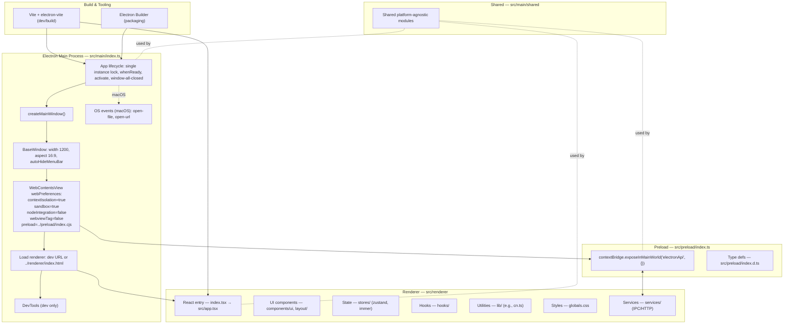

## Electron Starter Architecture

Below is the current architecture diagram. The source is also saved at `docs/assets/architecture.mmd`.

```mermaid
graph TB
  subgraph "Build & Tooling"
    BT1["Vite + electron-vite (dev/build)"]
    BT2["Electron Builder (packaging)"]
  end

  subgraph "Electron Main Process — src/main/index.ts"
    M1["App lifecycle: single instance lock, whenReady, activate, window-all-closed"]
    M2["createMainWindow()"]
    M3["BaseWindow: width 1200, aspect 16:9, autoHideMenuBar"]
    M4["WebContentsView webPreferences:<br/>contextIsolation=true<br/>sandbox=true<br/>nodeIntegration=false<br/>webviewTag=false<br/>preload=../preload/index.cjs"]
    M5["Load renderer: dev URL or ../renderer/index.html"]
    M6["DevTools (dev only)"]
    M7["OS events (macOS): open-file, open-url"]
  end

  subgraph "Preload — src/preload/index.ts"
    P1["contextBridge.exposeInMainWorld('electronApi', {})"]
    P2["Type defs — src/preload/index.d.ts"]
  end

  subgraph "Renderer — src/renderer"
    R1["React entry — index.tsx → src/app.tsx"]
    R2["UI components — components/ui, layout/"]
    R3["State — stores/ (zustand, immer)"]
    R4["Hooks — hooks/"]
    R5["Utilities — lib/ (e.g., cn.ts)"]
    R6["Styles — globals.css"]
    R7["Services — services/ (IPC/HTTP)"]
  end

  subgraph "Shared — src/main/shared"
    S1["Shared platform-agnostic modules"]
  end

  BT1 --> M1
  BT1 --> R1
  BT2 --> M1

  M1 --> M2 --> M3 --> M4 --> M5 --> M6
  M1 -. macOS .-> M7
  M4 --> P1
  M5 --> R1

  S1 -. used by .- M1
  S1 -. used by .- P1
  S1 -. used by .- R1

  P1 <--> R7
```

